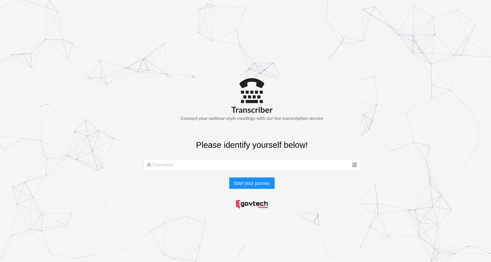

# Transcriber


Live transcription and web conferencing service based on WebRTC, Websockets and using DeepSpeech as a Speech-to-Text engine. Built for the HackYeah Summer 2020 hackathon.

## Authors

- Karolina Cynk
- Kamil Faber
- Cristian Schuszter

## Projects

#### Backend

The backend folder contains 2 different applications:

- one responsible for socket communication of transcripts (once they're available in rabbitmq in the `results` queue)
- one responsible for the actual transcriptions using DeepSpeech on the audio file sent through the messaging queue

#### Backend-webrtc

This is the backend (and server for the frontend) of the application, built with aiortc, aiohttp and requests. It provides 2 main features:

- webrtc server where peers connect to a meeting and receive a live audio and video stream from the presentation
- additional hooks for sending sound samples to the transcription service (in increments of 5 seconds)
- webhooks for real time chat and meeting membership status functionality


#### Frontends


## Setup

Run `build-frontend.sh` which will generate the frontend in the `build` folder in `backend-webrtc`.

In the `backend-webrtc` folder you can just run 

```
python aiortcapp.py
``` 

or 

```
USE_TRANSCRIBER=1 python aiortcapp.py
```


if you want to use the transcription service.


## Deployment

The backends using DeepSpeech and rabbitmq are deployed on Openshift, a private instance of ours. The `backend-webrtc` is deployed on IBM Cloud Foundry. 

After building the UI like above, you can cd to `backend-webrtc`, change the `manifest.yml` file and run `ibmcloud cf push` to create the application in the cloud.


## Screenshots




---


### Architecture

